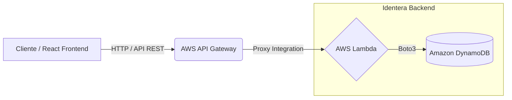

# Identera Backend

Este es el backend oficial del proyecto **Identera**, construido con [FastAPI](https://fastapi.tiangolo.com/) y diseñado para ser desplegado en un entorno Serverless utilizando **AWS SAM** y **AWS Lambda**, con **Amazon DynamoDB** como base de datos.

## Arquitectura

El sistema está diseñado para ser completamente Serverless en AWS, ofreciendo alta disponibilidad y bajo costo:



- **API Gateway**: Recibe las peticiones HTTP del frontend y las enruta a la función Lambda.
- **AWS Lambda**: Ejecuta el código de FastAPI a través del adaptador `Mangum`.
- **DynamoDB**: Almacena los perfiles de usuario y validaciones/carnets (Tabla `IdenteraDB`).

## Tecnologías Principales

- **Python 3.10**
- **FastAPI**: Framework web de alto rendimiento y fácil uso para construir APIs.
- **Uvicorn**: Servidor ASGI utilizado para desarrollo local.
- **Mangum**: Adaptador para ejecutar la aplicación FastAPI dentro de AWS Lambda (Serverless).
- **Boto3**: SDK de AWS para Python (usado para interactuar y realizar consultas a DynamoDB).
- **Pydantic**: Validación de datos y gestión de esquemas para los endpoints.

## Estructura del Proyecto

- `main.py`: Punto de entrada de la aplicación. Contiene la configuración de FastAPI, CORS y todas las rutas (API endpoints). También incluye el `handler` de Mangum para su funcionamiento en AWS Lambda.
- `database.py`: Lógica de interacción con la base de datos (Amazon DynamoDB). Maneja operaciones CRUD para usuarios y carnets/validaciones.
- `models.py`: Modelos de Pydantic que definen la estructura y validación de las solicitudes (requests) y respuestas que espera la API.
- `requirements.txt`: Dependencias de Python necesarias para ejecutar el proyecto.

## Desarrollo Local

Para correr el proyecto en tu entorno local:

1. **Crear y activar un entorno virtual** (recomendado):
   ```bash
   python -m venv venv
   # En Windows:
   venv\Scripts\activate
   # En macOS/Linux:
   source venv/bin/activate
   ```

2. **Instalar dependencias**:
   ```bash
   pip install -r requirements.txt
   ```

3. **Configuración de Variables de Entorno**:
   Copia el archivo `.env.example` a `.env` e incluye las variables necesarias (por ejemplo, accesos a base de datos local o en la nube, si corresponde).

4. **Ejecutar el servidor de desarrollo**:
   ```bash
   uvicorn main:app --reload --port 8000
   ```
   La API estará disponible en `http://localhost:8000`. 
   Puedes acceder a la documentación interactiva generada automáticamente por FastAPI en `http://localhost:8000/docs`.

## Guía de Despliegue en AWS (Producción)

Este backend utiliza **AWS Serverless Application Model (SAM)** para gestionar la infraestructura como código. Toda la configuración de recursos se encuentra en el archivo `template.yaml` (en la raíz general del repositorio).

### Prerrequisitos

- Cuenta activa de [AWS](https://aws.amazon.com/).
- Instalar y configurar [AWS CLI](https://aws.amazon.com/cli/). (Asegúrate de correr `aws configure` con tus credenciales).
- Instalar [AWS SAM CLI](https://docs.aws.amazon.com/serverless-application-model/latest/developerguide/install-sam-cli.html).
- Instalar [Docker](https://www.docker.com/) (opcional, pero recomendado por SAM para emular entornos Lambda localmente).

### Pasos de Despliegue

1. **Compilar el proyecto**:
   En la **carpeta raíz del repositorio** (donde se encuentra `template.yaml`), ejecuta:
   ```bash
   sam build
   ```
   Esto empaquetará tu código de Python y las dependencias de `requirements.txt`.

2. **Desplegar a AWS**:
   ```bash
   sam deploy --guided
   ```
   SAM te hará una serie de preguntas de configuración inicial:
   - **Stack Name**: Elige un nombre para tu proyecto en AWS (ej. `identera-backend`).
   - **AWS Region**: La región donde se creará tu infraestructura (ej. `us-east-1`).
   - **Confirm changes before deploy**: Opcional, presiona `Y` o `N`.
   - **Allow SAM CLI IAM role creation**: Responde `Y` para que SAM pueda crear permisos automáticamente.
   - **Disable rollback**: Responde `Y` o `N`.
   - Asegúrate de aceptar cuando se te pregunte permitir que el API Gateway autorice acceso público.

3. **Obtener la URL de la API**:
   Al finalizar el despliegue de manera exitosa, los **Outputs** en la terminal te mostrarán el `ApiUrl`. Deberás copiar esta URL para configurarla como variable de entorno en tu **Frontend** para que sepa a dónde realizar sus peticiones.
